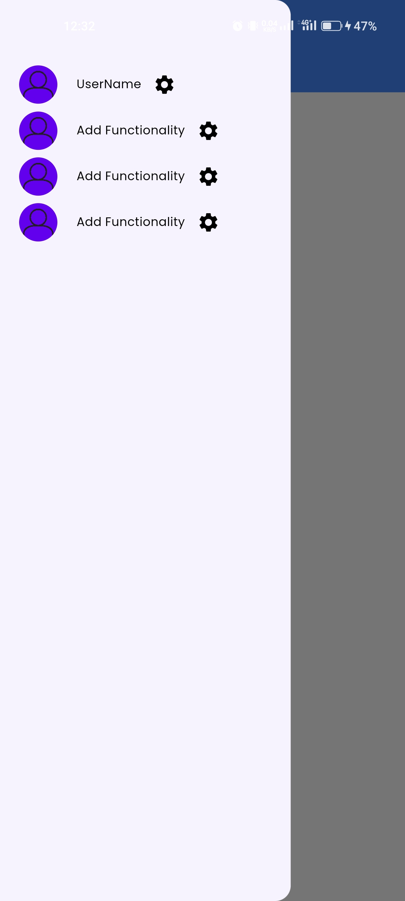

# Authentication App

Welcome to the `Authentication App` Flutter project! This project is designed to showcase various Flutter features, including state management, shared preferences, and internationalization.

## Key Features

### State Management with Provider

The project utilizes the Provider package for efficient state management. Provider is a popular state management solution in the Flutter community, offering a simple yet powerful way to manage the state of your app.

### Shared Preferences

Shared preferences are used to persist user preferences and data. This allows the app to store and retrieve information such as onboarding screen visibility and user settings even after the app is closed and reopened.

### Easy Localization

Easy Localization is integrated into the app to support multiple languages. The app is currently localized in English and Bengali, providing a localized experience based on the user's language preference.

### Splash Screen

The app features a splash screen that provides a visually appealing introduction to the user. The splash screen is designed to enhance the overall user experience and set the tone for the app.

## Screens

The app includes various screens that demonstrate different functionalities and features. Explore the app to discover the seamless user experience and the integration of state management, shared preferences, and internationalization.


     





## How to Run the App

1. Clone this repository to your local machine:

   ```bash
   git clone https://github.com/AAShayon01/authentication_app.git

## Navigate to the project directory:
cd authentication_app
flutter run
